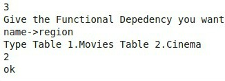

# MiniCompiler For Functional Depedencies

Compiler coded in **python** based on relational databases integrity constraints.

## Project Informations

- Implementation of a compiler given as input dummy Schema and Data.
- It checks the below constraints: 
    - 1. Primary key 
    - 2. Foreign Key 
    - 3. Other Functional Depedencies
  
 - Dummy Data and Schema used :
   - names[0] = [[101, 'Alex', 10], [102, 'Bob', 12], [103, 'Clarke', 13], [101, 'Alex', 7] ,[102, 'Bob', 12]

     names[1] = [[101,"Village" , "Rentis"],[102,"Athinaion","Ampelokipoi"],[101,"Athinaion","Ampelokipoi"]]
     
   - Movies(id,actor,hour),Cinema(movid,name,region)
   
 ### Primary Key Example 
 
 
 
 
 ### Foreign Key Example
 
 
 
 ### Other Functional Depedencies
 
 
